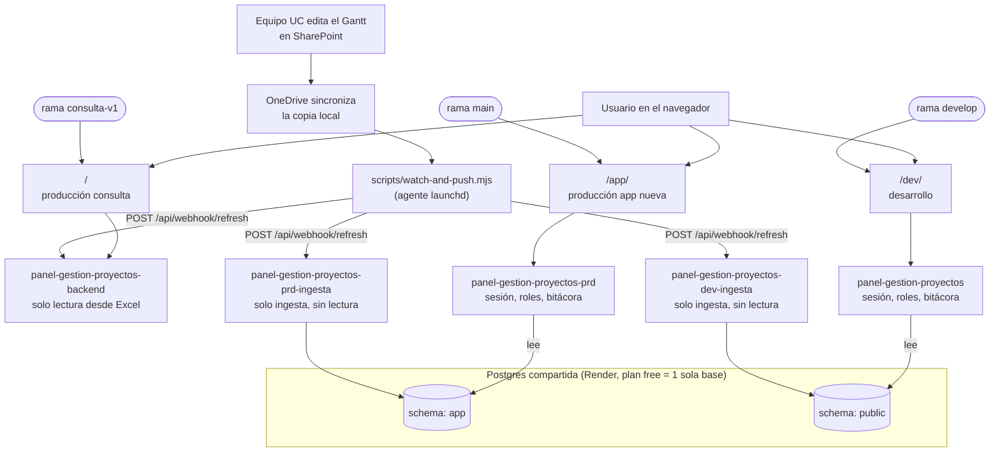

# Panel de Gestión de Proyectos

Aplicación web con frontend y backend separados, para la Dirección de IA ·
VRID · UC.

## Los tres entornos

Esta app corre en **tres sitios independientes**, cada uno desde su propia
rama, su propio backend y (en dos casos) su propio espacio de datos. Ninguno
pisa a los otros.

| Sitio | Rama | Qué es | Backend (Render) |
|---|---|---|---|
| [`/`](https://jimunozuc.github.io/panel-gestion-proyectos/) | `consulta-v1` (congelada) | Panel de **solo consulta** — la app original, sin login ni edición. Es lo que el equipo usa hoy. | `panel-gestion-proyectos-backend` (lee el Excel, sin Postgres) |
| [`/app/`](https://jimunozuc.github.io/panel-gestion-proyectos/app/) | `main` | **Producción de la app nueva** — con login, roles, alta/baja de hitos-tareas y bitácora de cambios. | `panel-gestion-proyectos-prd` (Postgres, schema `app`) |
| [`/dev/`](https://jimunozuc.github.io/panel-gestion-proyectos/dev/) | `develop` | Entorno de **pruebas** de la app nueva, antes de que un cambio llegue a `/app/`. | `panel-gestion-proyectos` (Postgres, schema `public`) |

Cada rama se despliega a su propia ruta (ver
`.github/workflows/deploy-pages.yml`) en un solo build de GitHub Pages —
probar algo en `develop` no afecta ni a `/app/` ni a `/`.

### Arquitectura de ramas — por qué no hay un "develop de la versión anterior"

`main` y `develop` son la producción y el desarrollo **de la app nueva**
únicamente. El panel de consulta original nunca tuvo (ni necesita) un par
dev/prod propio: es una rama **congelada** (`consulta-v1`, snapshot de lo
que era `main` antes de este proyecto) que no recibe commits nuevos. Si
algún día hiciera falta un cambio ahí, se ramifica puntualmente desde
`consulta-v1` para ese fix — no se reabre como línea de desarrollo activa.
Mantenerlo como snapshot congelado, y no como una app con su propio dev/prod,
es intencional: es la versión que se está reemplazando, no una que siga
evolucionando en paralelo.

## Arquitectura actual



El watcher empuja el Excel a 3 servicios — nunca al revés, ningún backend va
a buscarlo por su cuenta. `panel-gestion-proyectos-backend` (`/`) sigue
sirviendo solo desde Excel en memoria, sin Postgres. `/app/` y `/dev/` ya no
reciben el Excel directamente: cada uno de sus servicios de ingesta
(`*-prd-ingesta`, `*-dev-ingesta`) lo importa a su propio schema de Postgres,
y el backend de API correspondiente solo lee de ahí — nunca depende del
Excel salvo que Postgres mismo falle. Ver `## Origen de datos` más abajo
para el detalle completo.

## Navegación

Patrón de **riel fijo + breadcrumb** (`frontend/src/layouts/PanelLayout.jsx`):
un riel lateral izquierdo, siempre visible, con los 6 objetivos estratégicos
del Plan (además de una pestaña "Contexto" arriba de todos). Un breadcrumb
arriba del contenido muestra la ruta completa y permite subir de nivel con
un clic — no hace falta un botón de "volver" en cada vista.

```
Contexto (misión institucional + descripción de los 6 objetivos)
Seguimiento (consolidado de avance/hitos/carga de todos los proyectos reales)
Objetivo (6 Ejes del Plan, solo "Inteligencia digital" habilitado)
  → Iniciativa (6.1-6.5, tarjetas de 3 columnas, las 5 con descripción
    oficial del Plan — cada tarjeta lista sus proyectos reales como chips)
    → Ficha del proyecto (una por proyecto real, ej. "6.1.1 Nodo UC +IA";
      pestañas horizontales: KPI | Carta Gantt | Listado de Hitos |
      Distribución por Responsable | Roadmap | Mapa de Color | Glosario)
  → Administración (solo en /app/ y /dev/, solo rol administrador: usuarios,
    bitácora, solicitud de nuevo proyecto)
  → App Releases (avances y versiones de la app, link aparte al pie del riel)
```

En `/app/` y `/dev/`, el Listado de Hitos permite agregar, editar y borrar
hitos/tareas — pide identificarse la primera vez (modal "¿Quién eres?"),
sin contraseña todavía (login institucional real es la Versión 3, pendiente).
El rol **lector** es de solo lectura de verdad: no ve los botones de
agregar/editar/eliminar, y el backend rechaza esas escrituras aunque se
llamen directo a la API. En `/` (consulta) esas mismas vistas son de solo
lectura para cualquiera, sin login.

Los objetivos deshabilitados y los proyectos sin datos reales todavía se
muestran (gris, no clickeables) para representar el Plan completo aunque
solo una parte esté activa — no se inventan datos para los que no los tienen.

## Estructura

- `frontend/` — React + Vite. Sirve las vistas y llama al backend.
  - `src/data/plan.js` — nombres, color y descripción de los Ejes e
    Iniciativas 6.x, y la lista `proyectos[]` de cada iniciativa (cada uno
    con su propio `enabled`/`sheetId`). Editar aquí para habilitar otro eje,
    iniciativa o proyecto (necesita datos reales, no inventar contenido).
  - `src/layouts/PanelLayout.jsx` — el riel fijo + breadcrumb, envuelve todas
    las vistas vía `<Outlet />`.
  - `src/utils/SessionContext.jsx` — sesión (login "¿quién eres?", sin
    contraseña), expone `ensureSession()` para pedir identificación recién
    al primer intento de editar.
  - `src/pages/Contexto.jsx`, `src/pages/EjeDetail.jsx`,
    `src/pages/ProyectoFicha.jsx` — nivel 0 (contexto), nivel 1→2
    (objetivo → iniciativas) y nivel 3 (ficha del proyecto con pestañas).
  - `src/pages/Admin.jsx` — usuarios/roles, bitácora, solicitud de proyecto.
- `backend/` — Node.js + Express.
  - `src/ingestaServer.js` — servicio Render aparte para la ingesta de Excel
    (webhook + parseo + import a Postgres), desplegado como
    `panel-gestion-proyectos-{dev,prd}-ingesta` (mismo código/Dockerfile que
    la API, distinto Docker Command `npm run start:ingesta`) — primer corte
    de la dirección de microservicios (ver `## Microservicios`). `server.js`
    ya no tiene webhook propio: la API depende 100% de Postgres para leer,
    sin ruta de escritura.
  - `src/parseWorkbook.js` — parsea el Excel real recibido por el webhook de
    ingesta, **por nombre de columna**, no por posición.
  - `src/db/` — `pool.js` (conexión Postgres, `DB_SCHEMA` opcional para
    aislar entornos en una misma base), `migrate.js` + `migrations/` (schema
    versionado, corre solo al boot).
  - `src/nodos.js` — hitos/tareas como árbol de 3 niveles en la tabla
    `nodos`; `importAllSheets` copia cada hoja a Postgres una única vez, en
    cuanto llega por el webhook (no al leerla) — de ahí en más, Postgres
    manda y `GET /api/iniciativas/:num` ya no depende del Excel en memoria
    salvo que Postgres mismo falle.
  - `src/session.js`, `src/routes/session.js` — sesión por cookie, sin
    contraseña; el primer usuario que entra en una base nueva queda
    `administrador` automáticamente.
  - `src/routes/nodos.js` — alta/edición/baja de hitos-tareas, cada cambio
    registrado en `audit_log`.
  - `src/routes/admin.js` — usuarios/roles, bitácora, solicitud de proyecto.
  - Si Postgres no está disponible (o `DATABASE_URL` no está seteada), el
    backend **no se cae**: degrada solo a lectura desde el Excel.
- `scripts/` — `watch-and-push.mjs`, el watcher local que reemplaza a Power
  Automate (ver `## Origen de datos`).

## Cómo correr en local

Necesitas Node.js instalado (ver [nodejs.org](https://nodejs.org/), versión LTS).

**Backend:**

```bash
cd backend
npm install
npm run dev
```

Queda escuchando en `http://localhost:3001`. Con Postgres local corriendo y
`DATABASE_URL` en `backend/.env`, levanta con sesión/edición completas; sin
eso, sirve igual en modo solo-lectura desde el Excel de ejemplo.

**Frontend** (en otra terminal):

```bash
cd frontend
npm install
npm run dev
```

Abre `http://localhost:5173`.

**Con Docker (alternativa a lo anterior):**

```bash
cp .env.example .env   # completa REFRESH_SECRET
docker compose up --build
```

Backend en `http://localhost:3001` (con su propia Postgres en el mismo
`docker-compose.yml`), frontend en `http://localhost:8080`.

**Tests del backend:**

```bash
createdb panel_test   # una vez; base descartable, nunca la de desarrollo
cd backend
TEST_DATABASE_URL=postgres://localhost/panel_test npm test
```

`node --test` corre `parseWorkbook.test.js` (sin DB) y los tests de
`nodos.js`/`routes/nodos.js` (aplican migraciones y truncan las tablas antes
de cada test). Sin `TEST_DATABASE_URL` seteada, esos archivos fallan rápido
en vez de correr contra `DATABASE_URL` real — nunca apunten esta variable a
la base de datos de desarrollo/producción. CI (`.github/workflows/backend-ci.yml`)
corre lo mismo contra un Postgres descartable en cada PR.

## Estado actual

- Navegación de riel fijo + breadcrumb: **hecho**, con colores
  institucionales UC, tipografía Roboto e íconos Material Symbols Rounded.
- Panel de Gestión: 7 vistas con datos reales (KPI, Carta Gantt, Listado de
  Hitos, Distribución por Responsable, Roadmap, Mapa de Color, Glosario).
- Persistencia en Postgres, sesión sin contraseña, roles
  (administrador/editor/lector) y bitácora de cambios: **hecho**, en `/app/`
  y `/dev/` — `/` sigue siendo solo lectura desde Excel a propósito.
- Alta/baja de hitos y tareas, edición de responsable, solicitud de nuevo
  proyecto (formulario en Administración, el alta real en `plan.js` la sigue
  haciendo una persona): **hecho**.
- Login institucional (CAS/Entra ID de la UC, reemplazando el "¿quién eres?"
  actual): **pendiente** — falta la URL del proveedor real.
- App Releases: página con los avances/versiones de la app (ver
  `frontend/src/data/releases.js` para agregar entradas nuevas).

## Roadmap

### Versión 2.1 — Publicar en GitHub Pages ✅ hecho
### Versión 2.2 — Migrar las 7 vistas del Panel de Gestión con datos reales ✅ hecho
### Versión 2.3 — Rediseño de navegación (riel fijo + breadcrumb) ✅ hecho
### Versión 2.4 — Nivel de proyecto por iniciativa ✅ hecho

### Versión 3.0 — Persistencia, sesión y edición ✅ hecho
La app pasa de "mostrar datos" a "ser la fuente de la verdad": Postgres
reemplaza al Excel como origen para cada hoja una vez migrada, con sesión
sin contraseña, roles, bitácora de cambios, y alta/baja de hitos-tareas
desde la propia interfaz. Desplegado como entorno productivo **separado**
del panel de consulta (`/app/`), sin reemplazarlo — ver `## Los tres
entornos` arriba.

### Versión 3.1 — Login institucional (pendiente)
Reemplazar el modal "¿Quién eres?" por el CAS/Entra ID real de la UC —
requiere la URL del proveedor y probablemente aprobación de TI. Se descartó
antes conectar el backend directamente a Microsoft Graph API para leer el
Excel (ver `## Origen de datos`) por la misma razón: requiere un registro
de aplicación más complejo de lo necesario.

### Versiones futuras
- ~~Automatizar la carga de Excel a `/app/` y `/dev/`~~ **hecho en el
  script** (`PUSH_TARGETS_JSON`, ver `## Origen de datos`) — falta el paso
  manual de cargar la variable en el `launchd` plist local con los tres
  destinos reales.
- Fase de exportación: Postgres → Excel de respaldo diario (una vez que el
  equipo confíe en editar solo desde la app, el watcher se apaga).
- Ver `## Microservicios` para la dirección de arquitectura a mediano plazo.

## Microservicios

Dirección de arquitectura confirmada: **el desarrollo futuro va hacia
microservicios**, no hacia un monolito más grande. Primer corte ya hecho:
**ingesta de Excel** (parseo + webhook + import a Postgres) es hoy un
servicio Render aparte (`src/ingestaServer.js`, desplegado como
`panel-gestion-proyectos-{dev,prd}-ingesta`), sin código de ruteo por
entorno — mismo patrón que los 2 backends de API (mismo código, distinto
`DATABASE_URL`/`DB_SCHEMA`, distinto Docker Command). Candidatos para el
próximo corte, cuando se aborde:

- **Sesión/usuarios** separado de hitos/nodos.
- **Administración/auditoría** como su propio servicio de solo lectura.

No se fragmenta sin necesidad concreta: dividir prematuramente, sin que un
límite de responsabilidad real lo justifique, agrega complejidad operativa
(más despliegues, más bases o colas, más latencia entre servicios) sin
beneficio. La compartición forzada de una sola Postgres entre `/app/` y
`/dev/` (por límite de plan, aislados por schema, no por servicio) es un
ejemplo concreto de la tensión actual entre "microservicios" como objetivo
y "un plan gratuito de Render" como restricción real — ver la tabla de
Azure más abajo para cómo se vería esto en un entorno productivo real, sin
esa restricción.

## Azure — comparativa si se migra desde Render

No es una migración planeada todavía (falta que el usuario cree la
suscripción — ver `[[project-write-back-exploration]]`), pero queda
documentado acá para no perder el análisis. Mapeo pieza a pieza de lo que
hoy corre en `/app/`:

| Hoy (Render + GitHub Pages) | Equivalente en Azure | Por qué / qué cambia |
|---|---|---|
| GitHub Pages (frontend estático, 3 sub-rutas) | **Azure Static Web Apps** | Integración nativa con GitHub Actions (reemplaza el paso de deploy, no el workflow completo); el modelo de "entornos de preview" de SWA no calza 1:1 con nuestras 3 sub-rutas fijas (`/`, `/app/`, `/dev/`) — hay que rediseñar esa parte, no es un swap directo. |
| Render Web Service (`Node`, buildpack) | **Azure Container Apps** (recomendado) o Azure App Service (Linux/Node) | `backend/Dockerfile` y `frontend/Dockerfile` ya existen y ya se usan en `docker-compose.yml` local — Container Apps los consume tal cual, sin empaquetado nuevo. App Service es el lift-and-shift más literal (sin Docker, como Render hoy) pero encaja peor con la dirección a microservicios. |
| Postgres compartida por schema (`DB_SCHEMA=app`/`public`, límite del plan free de Render) | **Azure Database for PostgreSQL – Flexible Server** | Elimina la razón original del hack de schema: un Flexible Server soporta varias bases reales sin costo extra por base. Se puede mantener el aislamiento por schema (más barato, un solo server) o pasar a bases separadas por entorno — ya no es una restricción de plan, es una decisión de diseño. |
| Cold starts en plan free | Container Apps consumption plan también escala a cero por defecto | El problema no lo resuelve "cambiarse a Azure" por sí solo — hay que elegir explícitamente un plan con mínimo de instancias activas si el cold start molesta, en cualquiera de las dos nubes. |
| Push manual del Excel al webhook (`POST /api/webhook/refresh`) | Azure Function (timer trigger) o Logic App, si algún día se resuelve el consentimiento de Graph API | Azure no destraba por sí solo el bloqueo real (el tenant UC exige sesión Microsoft incluso con links "cualquiera con el vínculo" — ver `## Origen de datos`); solo tiene sentido si ese permiso de Graph API se gestiona aparte con TI. Mientras tanto, automatizar el POST actual (ver más abajo) no depende de estar en Azure. |
| Login "¿Quién eres?" (pendiente CAS/Entra ID) | Azure AD / Entra ID App Registration + Easy Auth de App Service/Container Apps | Si el proveedor final es Entra ID (probable, mismo ecosistema Microsoft que SharePoint/OneDrive), alojar el backend en Azure acorta ese trabajo de integración vs. hacerlo desde Render — pero sigue bloqueado en lo mismo: falta la URL/tenant que solo puede dar TI UC. |

**Costo:** hoy el stack corre a costo cero (Render free + GitHub Pages
free), a cambio de las restricciones de arriba. El único ítem nuevo que
tendría costo real en Azure es la base de datos (Flexible Server Burstable,
gama baja) — confirmar primero si la Postgres compartida actual sigue
siendo free tier de Render o si ya se pagó para evitar el límite de una
sola base, para comparar manzanas con manzanas.

**Cuándo tendría sentido moverse:** no es urgente hoy. Se vuelve una
decisión real cuando pase alguna de estas tres cosas: (1) el hack de schema
compartido en una sola Postgres empieza a doler de verdad, (2) el primer
corte de microservicios de la sección anterior efectivamente se hace —
Container Apps encaja mejor que crear N servicios Render sueltos para eso
— o (3) la universidad ya tiene tenant/suscripción Azure activos, lo que
abarataría además la integración de login institucional.

## Origen de datos

Se descartó conectar el backend directamente a Microsoft Graph API o a un
link de SharePoint: el tenant de la UC exige sesión de Microsoft incluso
para links marcados como "Cualquiera con el vínculo" (probado y confirmado
— devuelve 403). También se descartó Power Automate como intermediario: el
paso que hace el POST HTTP requiere licencia Premium, y ni la prueba
gratuita de 90 días ni Make.com (mismo problema de consentimiento a apps de
terceros en el tenant) resultaban una solución permanente. En su lugar, un
**script local corre en la máquina del usuario**, vigilando la copia del
Excel ya sincronizada por OneDrive:

```
Equipo edita el Gantt en SharePoint (como siempre)
  → OneDrive sincroniza el cambio a la copia local en este Mac
  → scripts/watch-and-push.mjs detecta el cambio (fs.watch + debounce)
    y también reenvía cada 5 min como respaldo (por si el watch se pierde
    un evento, ej. el Mac estaba dormido)
  → POST a /api/webhook/refresh (+ secreto compartido) a 3 destinos:
    - panel-gestion-proyectos-backend (/, recalcula en memoria, sin Postgres)
    - panel-gestion-proyectos-dev-ingesta y -prd-ingesta (/dev/ y /app/,
      cada uno importa a su propio schema de Postgres — importAllSheets,
      una vez por hoja nueva)
  → GET /api/iniciativas/:num en /app/ y /dev/ lee solo de Postgres — el
    Excel en memoria queda como resguardo únicamente si Postgres mismo
    falla (esos backends ya no reciben el Excel, no tienen otra forma de
    poblar ese cache que no sea el archivo de ejemplo bundled)
```

El backend nunca descarga nada por su cuenta — solo recibe lo que le
envían. El script corre como agente de `launchd`
(`~/Library/LaunchAgents/com.panelgestion.excelwatcher.plist`, fuera del
repo) y arranca solo al iniciar sesión en el Mac — por lo que los datos
solo se actualizan mientras esa máquina esté encendida y con OneDrive
sincronizando.

**Empuje a varios destinos a la vez:** `scripts/watch-and-push.mjs` acepta
una variable `PUSH_TARGETS_JSON` con un array de destinos
(`[{"name":"...","url":"...","secret":"..."}]`), uno por servicio, cada uno
con su propio `REFRESH_SECRET` (son distintos entre servicios). Si no se
setea, sigue funcionando como antes con un solo destino
(`BACKEND_URL`/`REFRESH_SECRET`). Hoy son 3: el backend viejo de `/` y los 2
servicios de ingesta de `/app/`/`/dev/` — los backends de API de `/app/` y
`/dev/` ya no son destino directo, solo leen Postgres.

**Estructura del Excel:** una hoja por iniciativa/proyecto. El backend
soporta dos formatos (`backend/src/parseWorkbook.js`): el Gantt real (con
`% avance` explícito, columnas `Proyecto | Subproyecto | Tipo | Nombre |
Responsable | Fecha inicio | Fecha limite`) y un formato simple de lista
(usado solo por el archivo de ejemplo para desarrollo local).

Hoy hay tres hojas reales conectadas — `P6.1.1`, `P6.1.2` y `P6.1.3` (ver
`proyectos[]` en `frontend/src/data/plan.js`).

Mientras un backend no reciba ningún archivo (recién desplegado, o antes del
primer push) — o, en `/app/`/`/dev/`, cada vez que Postgres falla, ya que
esos dos nunca vuelven a recibir el Excel directamente — sirve
`backend/data/panel_iniciativas.xlsx` como respaldo local. Ese archivo de
ejemplo solo tiene el formato simple viejo (6.0/6.1/6.2), no las hojas
reales P6.1.x.

### Pasos para desplegar un backend nuevo en Render

Ver el runbook completo usado para `/dev/` y `/app/` — resumen:

1. **Web Service**: New → Web Service → repo `panel-gestion-proyectos` →
   Root Directory `backend` → Branch según el entorno (`develop` para dev,
   `main` para producción de la app nueva).
2. **Postgres**: si el plan permite más de una base, una nueva por entorno.
   Si no (plan free de Render solo permite una), **reusar la misma
   Postgres** y aislar por schema: `DATABASE_URL` igual en ambos servicios,
   más una variable `DB_SCHEMA` distinta en cada uno (ej. `app`, `public`) —
   soportado nativamente en `backend/src/db/pool.js` vía `search_path`. Crear
   el schema nuevo a mano una vez: `CREATE SCHEMA nombre;`.
3. **Env vars** en el web service: `DATABASE_URL`, `DB_SCHEMA` (si aplica),
   `CORS_ORIGIN` (el origen exacto de GitHub Pages, sin path), `NODE_ENV=production`,
   `COOKIE_SECRET` (random), `REFRESH_SECRET` (random, para el webhook).
   Opcional: `BOOTSTRAP_ADMIN_NAMES` (nombres separados por coma) para que
   personas puntuales queden `administrador` automáticamente en cada login
   en ese entorno, sin depender de "ser el primer usuario" ni de tocar la
   base a mano.
4. En GitHub: variable de Actions `VITE_API_URL_<ENTORNO>` con la URL del
   servicio nuevo, y el build correspondiente en
   `.github/workflows/deploy-pages.yml` apuntando a esa variable.

**Para un servicio de ingesta en vez de la API** (mismo repo/rama/Root
Directory que su par API, mismo Dockerfile): en Advanced, **Docker Command**
`npm run start:ingesta` en vez del default. Env vars: solo `DATABASE_URL`,
`DB_SCHEMA` (el mismo que su par API — escriben al mismo schema que la API
lee), `REFRESH_SECRET` y **`NODE_ENV=production`** (sin esta, `pool.js` no
habilita SSL y la conexión falla de un modo indistinguible del típico "Postgres
no disponible" — fácil de perder tiempo depurando a ciegas). Sin
`CORS_ORIGIN`/`COOKIE_SECRET`/`BOOTSTRAP_ADMIN_NAMES` — ingesta no tiene
cookies, CORS ni usuarios. Sin paso 4: nadie en el frontend le habla a este
servicio, así que no hay `VITE_API_URL` que apuntarle — la URL nueva es para
`PUSH_TARGETS_JSON` del watcher (`scripts/.env.example`), no para GitHub Pages.

**Cuidado conocido:** el servicio Render de un branch productivo (ej.
`main`) puede quedar corriendo código viejo simplemente porque nadie pusheó
nada nuevo a ese branch en un tiempo — no asumir que "está en la rama X" es
lo mismo que "corre el código de hoy de la rama X". Verificar siempre con
`GET /api/session` (200 `{"user":null}` = código con sesión; 404 = código
viejo) antes de dar por sentado el estado de un servicio.

## Nota sobre otro proyecto en este equipo

Existe un proyecto separado y anterior, `panel-de-iniciativas`
(`github.com/jimunozuc/panel-de-iniciativas`), que genera un dashboard de una
sola página a partir del mismo Excel usando un script Python + GitHub Actions.
Ese proyecto sigue funcionando de forma independiente y no se modifica desde
aquí.
