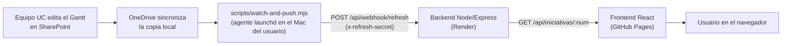

# Panel de Gestión de Proyectos

Aplicación web con frontend y backend separados, para la Dirección de IA ·
VRID · UC.

**Producción** (rama `main`): https://jimunozuc.github.io/panel-gestion-proyectos/
**Desarrollo** (rama `develop`): https://jimunozuc.github.io/panel-gestion-proyectos/dev/

Cada rama se despliega a su propia ruta (ver
`.github/workflows/deploy-pages.yml`), así que probar cosas en `develop` no
pisa la versión publicada en `main`.

## Arquitectura actual



El backend nunca va a buscar el archivo por su cuenta: solo recibe lo que el
watcher local le envía (push), y mientras tanto sirve un respaldo local
embebido. Ver `## Origen de datos` más abajo para el detalle completo.

## Navegación

```
Iniciativas (6 Ejes del Plan, solo "Inteligencia digital" habilitado)
  → Inteligencia digital (6.0-6.5, solo "6.2 Desarrollo y despliegue" habilitada)
    → Panel de Gestión (Menú: KPI | Carta Gantt | Listado de Hitos |
      Distribución por Responsable | Roadmap | Mapa de Color | Glosario)
  → App Releases (avances y versiones de la app)
```

Cada vista tiene su botón de volver al nivel anterior. Los ejes/iniciativas
deshabilitados se muestran (gris, no clickeables) para representar el Plan
completo aunque solo una parte esté activa.

## Estructura

- `frontend/` — React + Vite. Sirve las vistas y llama al backend.
  - `src/data/plan.js` — nombres y estado enabled/disabled de los Ejes e
    Iniciativas 6.x. Editar aquí para habilitar otro eje/iniciativa.
- `backend/` — Node.js + Express. Recibe el Excel real (Gantt de una sola
  hoja, ver `## Origen de datos`) vía `POST /api/webhook/refresh` y expone
  `GET /api/iniciativas/:num` con los datos ya procesados (árbol línea →
  iniciativa → actividad/hito). `backend/src/parseWorkbook.js` soporta dos
  formatos: el Gantt real (con `% avance` explícito) y un formato simple de
  lista (usado por el archivo de ejemplo para desarrollo local).
- `scripts/` — `watch-and-push.mjs`, el watcher local que reemplaza a Power
  Automate (ver `## Origen de datos`).

## Cómo correr en local

Necesitas Node.js instalado (ver [nodejs.org](https://nodejs.org/), versión LTS).

**Backend:**

```bash
cd backend
npm install
npm run dev
```

Queda escuchando en `http://localhost:3001`.

**Frontend** (en otra terminal):

```bash
cd frontend
npm install
npm run dev
```

Abre `http://localhost:5173`.

**Con Docker (alternativa a lo anterior):**

```bash
cp .env.example .env   # completa REFRESH_SECRET
docker compose up --build
```

Backend en `http://localhost:3001`, frontend en `http://localhost:8080`. Cada
`docker compose up --build` reconstruye las imágenes con el código actual —
útil para instalar/correr todo con un solo comando sin instalar Node.js.

## Estado actual

- Navegación Iniciativas → Ejes → Panel de Gestión: **hecha**, con colores
  institucionales UC (`--uc-azul:#0176DE --uc-navy:#03122E
  --uc-amarillo:#FEC60D`).
- Panel de Gestión: 7 botones de prueba (KPI, Carta Gantt, Listado de Hitos,
  Distribución por Responsable, Roadmap, Mapa de Color, Glosario). Cada uno
  abre una página con una tabla `Nombre de la página | Descripción` — solo
  para validar que la estructura de navegación y cada botón funcionan;
  el contenido real se migra pieza por pieza (ver Versión 2.2 abajo).
- App Releases: página con los avances/versiones de la app (ver
  `frontend/src/data/releases.js` para agregar entradas nuevas).
- Acceso: pensado para quedar restringido a cuentas de la organización, pero
  esa parte (login) todavía no está implementada.

## Roadmap

### Versión 2.1 — Publicar en GitHub Pages ✅ hecho
Deploy automático vía `.github/workflows/deploy-pages.yml` en cada push a
`main` que toque `frontend/`.

### Versión 2.2 — Probar nuevas funcionalidades (en curso)
Migrar, de a una pieza a la vez, funcionalidades de los artefactos existentes
hacia esta app modular. **El usuario decide cuándo empezar cada pieza
(avisa con "AHORA" + cuál); no se construye nada de esto por adelantado.**

Hecho hasta ahora: la capa de navegación Iniciativas/Ejes (ver arriba).

**Piezas pendientes de migrar**, identificadas en dos artefactos de
referencia:
- `/Users/usuario/Documents/panel-de-iniciativas/src/dashboard_template.html`
- `/Users/usuario/Downloads/ucbots_dashboard.html` (versión más nueva/distinta,
  de donde salieron los colores UC)

| Componente | Qué hace | Destino sugerido |
|---|---|---|
| `ResumenTab` / `Resumen` | Tarjetas de KPIs / resumen general | Vista KPI |
| `GanttTab` / `Gantt` | Carta Gantt de tareas por proyecto | Vista Carta Gantt |
| `HitosTab` / `Hitos` | Listado de hitos | Vista Listado de Hitos |
| `EquipoTab` / `Equipo` | Distribución de tareas por responsable | Vista Distribución por Responsable |
| `RoadmapTab` / `Roadmap` | Roadmap trimestral | Vista Roadmap |
| `HeatmapTab` / `Heatmap` | Mapa de calor de carga de trabajo | Vista Mapa de Color |

**Fuente de datos:** ver `## Origen de datos` más abajo — el backend lee
`panel_iniciativas.xlsx` (una hoja por iniciativa 6.x) y ya no usa datos
"en duro".

### Versión 3 — Login institucional (pendiente)
Login con cuenta Microsoft/UC (Entra ID), para que solo gente de la
organización pueda ver la app. Requiere registrar una aplicación en el
Entra ID de la universidad — puede necesitar aprobación de TI. Se descartó
conectar el backend directamente a Microsoft Graph API para leer el Excel
(ver sección de abajo) porque ese registro de app resultó más complejo de
lo necesario para lo que se necesitaba lograr.

### Versiones futuras
Iteraciones adicionales por definir a medida que la app avance.

**Microservicios (idea a futuro, sin definir todavía):** se planteó dividir
el desarrollo en microservicios para escalarlo mejor. Hoy la app ya tiene una
separación mínima (frontend / backend); antes de fragmentar más hace falta
definir qué responsabilidad justificaría un servicio aparte (¿ingesta de
datos separada del API? ¿un servicio por eje del Plan?) — no conviene
dividir sin un límite de responsabilidad claro. Por ahora se avanzó solo con
Docker (ver `## Cómo correr en local`) para que instalar/correr la app sea
más simple, sin inventar servicios nuevos todavía.

## Origen de datos

Se descartó conectar el backend directamente a Microsoft Graph API o a un
link de SharePoint: el tenant de la UC exige sesión de Microsoft incluso
para links marcados como "Cualquiera con el vínculo" (probado y confirmado
— devuelve 403). También se descartó Power Automate como intermediario: el
paso que hace el POST HTTP requiere licencia Premium, y ni la prueba
gratuita de 90 días ni Make.com (mismo problema de consentimiento a apps de
terceros en el tenant) resultaban una solución permanente. En su lugar, un
**script local corre en la máquina del usuario**, vigilando la copia del
Excel ya sincronizada por OneDrive:

```
Equipo edita panel_iniciativas.xlsx en SharePoint (como siempre)
  → OneDrive sincroniza el cambio a la copia local en este Mac
  → scripts/watch-and-push.mjs detecta el cambio (fs.watch + debounce)
    y también reenvía cada 5 min como respaldo (por si el watch se pierde
    un evento, ej. el Mac estaba dormido)
  → POST a /api/webhook/refresh con el archivo en el body (+ secreto compartido)
  → backend recalcula los datos en memoria
  → GET /api/iniciativas/:num sirve los datos ya frescos al frontend
```

El backend nunca descarga nada por su cuenta — solo recibe lo que le
envían. El script corre como agente de `launchd`
(`~/Library/LaunchAgents/com.panelgestion.excelwatcher.plist`, fuera del
repo) y arranca solo al iniciar sesión en el Mac — por lo que los datos
solo se actualizan mientras esa máquina esté encendida y con OneDrive
sincronizando.

**Estructura del Excel:** una hoja por iniciativa (`6.0`, `6.1`, `6.2`, ...
el número es referencial y puede cambiar). Cada hoja tiene las columnas
`Proyecto | Subproyecto | Tipo (Hito/Actividad) | Nombre | Responsable |
Fecha inicio | Fecha limite`. El backend agrupa por Proyecto → Subproyecto
→ fila, y calcula el avance (0-100%) comparando Fecha inicio/Fecha límite
contra la fecha de hoy (no hay columna de avance manual). Ver
`backend/src/parseWorkbook.js`.

Por ahora solo la hoja `6.2` (única iniciativa habilitada, ver
`frontend/src/data/plan.js`) se conecta a las vistas Listado de Hitos y
Distribución por Responsable.

Mientras el backend no reciba ningún archivo (recién desplegado, antes del
primer push del script local), sirve `backend/data/panel_iniciativas.xlsx`
como respaldo local.

### Pasos para dejar esto funcionando en producción

**1. Desplegar el backend en Render**

- Entra a [render.com](https://render.com) → "Get Started" →
  "Sign up with GitHub" (así Render se conecta directo a tu cuenta de
  GitHub, sin crear una contraseña nueva).
- En el dashboard, botón "New +" (arriba a la derecha) → "Blueprint".
- Elige el repositorio `panel-gestion-proyectos` (si no aparece en la
  lista, usa "Configure account" para darle acceso a ese repo).
- Render detecta el archivo `render.yaml` de este repo automáticamente y
  te va a pedir un valor para `REFRESH_SECRET`: inventa un texto largo y
  difícil de adivinar (como una contraseña) — **guárdalo**, lo necesitas
  en el paso 3.
- Click en "Apply"/"Create New Resources" y espera 1-2 minutos a que el
  build termine y el estado quede en "Live" (verde).
- Copia la URL pública que te asigna (algo como
  `https://panel-gestion-proyectos-backend.onrender.com`).

  *Nota:* en el plan gratuito, el backend "se duerme" tras ~15 min sin
  tráfico y tarda unos 30-60 segundos en despertar en la próxima llamada
  — normal, no es un error.

**2. Conectar el frontend publicado a ese backend**

Necesitas crear una variable en GitHub llamada `VITE_API_URL` con la URL
de Render del paso 1 (Settings → Secrets and variables → Actions →
pestaña "Variables" → "New repository variable"). Si prefieres, pásame la
URL de Render cuando la tengas y lo hago yo directamente con `gh`.

**3. Instalar el watcher local**

1. Sincroniza a tu Mac la carpeta de SharePoint donde vive
   `panel_iniciativas.xlsx` (OneDrive → sitio `uc365_SIAI` → biblioteca
   "Documentos" → carpeta "0. Prueba_gestión de proyectos" → botón
   "Sincronizar"). Queda bajo
   `~/Library/CloudStorage/OneDrive-...`.
2. Copia `scripts/.env.example` a `scripts/.env` (este archivo está en
   `.gitignore`, nunca se sube) y completa `EXCEL_FILE_PATH` con la ruta
   real de la copia local, `BACKEND_URL` con la URL de Render, y
   `REFRESH_SECRET` con el mismo valor cargado en Render.
3. Prueba manualmente: `node --env-file=scripts/.env
   scripts/watch-and-push.mjs` — debería loguear "vigilando ..." y
   "enviado (startup)".
4. Para que corra solo al iniciar sesión, instala un agente de `launchd`
   apuntando a `scripts/watch-and-push.mjs` con esas mismas variables de
   entorno (ver `~/Library/LaunchAgents/com.panelgestion.excelwatcher.plist`
   en la máquina ya configurada como referencia). Carga con `launchctl load
   ~/Library/LaunchAgents/com.panelgestion.excelwatcher.plist`.

El script reacciona al cambio del archivo (con un debounce de 5s) y además
reenvía cada `BACKUP_INTERVAL_MINUTES` (5 por defecto) como respaldo — el
intervalo es corto a propósito: cada vez que Render reinicia el backend
(redeploy, o el plan gratuito "durmiendo" tras inactividad) pierde el caché
en memoria y sirve el respaldo local embebido hasta el próximo push.

## Nota sobre otro proyecto en este equipo

Existe un proyecto separado y anterior, `panel-de-iniciativas`
(`github.com/jimunozuc/panel-de-iniciativas`), que genera un dashboard de una
sola página a partir del mismo Excel usando un script Python + GitHub Actions.
Ese proyecto sigue funcionando de forma independiente y no se modifica desde
aquí.
